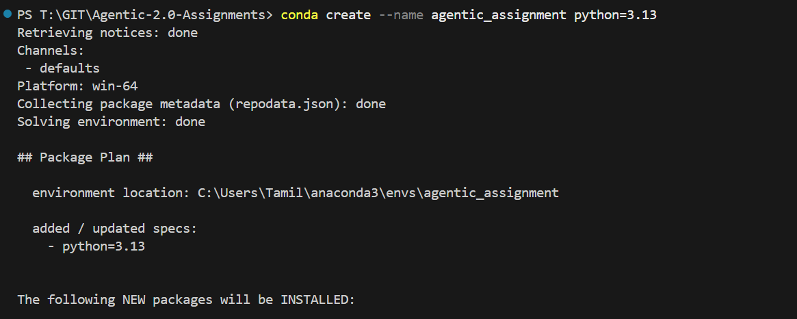
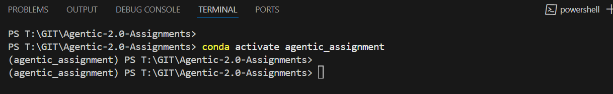

Create a new Conda Env
```sh
conda create --name agentidc_assignment python=3.13
```
Type "y" to install



Activate the env

```sh
conda activate agentic_assignment
```


Install Requirements

```sh
pip install -r requirements.txt
```


Refernce links
```js
https://python.langchain.com/docs/how_to/structured_output/
```